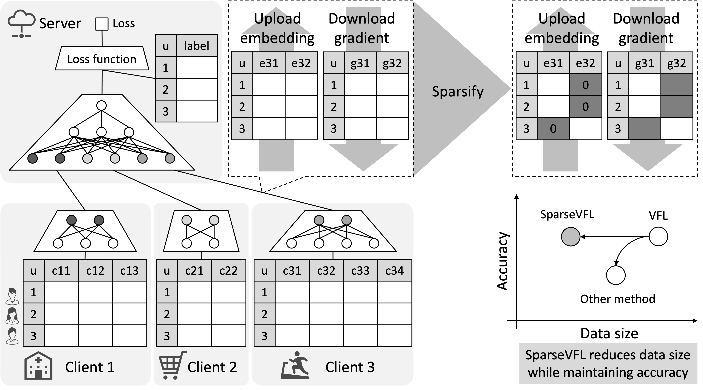

# SparseVFL: Communication-Efficient Vertical Federated Learning Based on Sparsification of Embeddings and Gradients
This repository contains the source code of Python/PyTorch scripts for Vertical Federated Learning. See our paper for a detailed description of SparseVFL.

> **SparseVFL: Communication-Efficient Vertical Federated Learning Based on Sparsification of Embeddings and Gradients** <br/>
> *Yoshitaka Inoue, Hiroki Moriya, Qiong Zhang, Kris Skrinak* <br/>
> Paper: https://openreview.net/forum?id=BVH3-XCRoN3 <br/>
> Accepted by: [KDD FL4Data-Mining '23: International Workshop on Federated Learning for Distributed Data Mining](https://fl4data-mining.github.io/)<br/>
> Published on: August 7, 2023



## Environment
- python 3.8.11
- torch 1.7.1+cu101
- pandas 1.2.3
- numpy 1.20.2
- scikit-learn 0.24.1
- tqdm 4.60.0
- tensorboard 2.4.1

## Quickstart
1. Download adult.zip from https://archive.ics.uci.edu/dataset/2/adult
2. Save the zip as ```data/original/adult/adult.zip```
3. ```cd data/original/adult```
4. ```unzip adult.zip```
5. ```cd ../../../```
6. Run the following python scripts

```shell
python data_adult.py
python sparsevfl.py --layer_no_bias --sparse_embed_lambda 0.0100 --interface_dims 8,8,8 --reduction svfl16 --model_header sparsevfl_adult3 --data_dir data/adult3 --lr 0.01 --tsv_name result_1.tsv
```

## Reproduce paper results
Refer to the instructions at the beginning of the script ```data_***.py``` to download the dataset, then run the following scripts.

```shell
python data_adult.py
bash eval_adult.sh

python data_wine-quality.py
bash eval_wine-quality.sh

python data_covtype.py
bash eval_covtype.sh
```

## License
- MIT License

## Citation
```bibtex
@inproceedings{
inoue2023sparsevfl,
title={Sparse{VFL}: Communication-Efficient Vertical Federated Learning Based on Sparsification of Embeddings and Gradients},
author={Yoshitaka Inoue and Hiroki Moriya and Qiong Zhang and Kris Skrinak},
booktitle={International Workshop on Federated Learning for Distributed Data Mining},
year={2023},
url={https://openreview.net/forum?id=BVH3-XCRoN3}
}
```

## Contact
- **Yoshitaka Inoue** (yoshitaka.inoue@docomoinnovations.com), DOCOMO Innovations
- Hiroki Moriya (hiroki.moriya@docomoinnovations.com), DOCOMO Innovations
- Qiong Zhang (zhangyqi@amazon.com), Amazon Web Services
- Kris Skrinak (skrinak@amazon.com), Amazon Web Services


## References
We have implemented VFL on AWS. See the following pages. SparseVFL will also be implemented on AWS in the near future.
- [Building a Cloud-Native Architecture for Vertical Federated Learning on AWS](https://aws.amazon.com/jp/blogs/apn/building-a-cloud-native-architecture-for-vertical-federated-learning-on-aws/) (AWS Partner Network Blog)
- [Cloud Native Vertical Federated Learning on AWS](https://github.com/docomoinnovations/AWS-Serverless-Vertical-Federated-Learning) (GitHub)

VFL tutorial with Python/PyTorch (*in Japanese*).
- [【Python】PyTorch で作る Vertical Federated Learning](https://nttdocomo-developers.jp/entry/202212011200) (NTT DOCOMO Developers Blog)